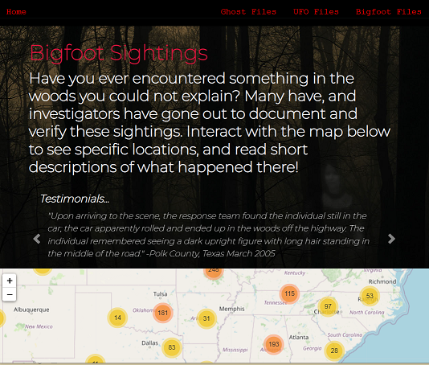
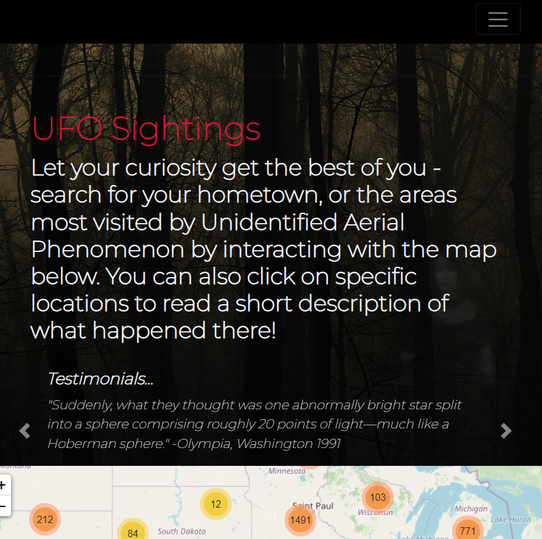
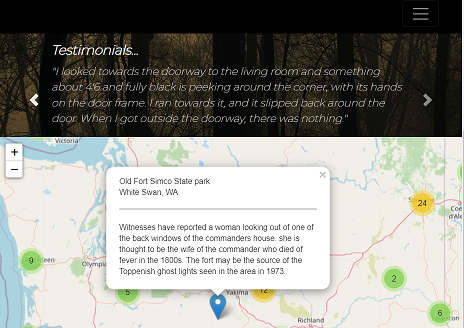

<!-- <h1 text-aligh:center;><b>Track the Paranormal!</b></h1> -->

<h1>

<strong>Hello, welcome to our project!  We wanted to bring the spooky to you to peruse at your leisure.</strong></h1>

<h3>When you arrive at our website, you will notice three topics to explore: Ghost Files, UFO Files, and Bigfoot Files. Navigating to each of these pages (or clicking on the corresponding creepy image) will bring you to a page with: </h3>

- Interactive Leaflet maps that show density of sightings/events
- Specific locations and brief descriptions of reports via map markers
- Testimonial carousel of hauntings, UFO events, and bigfoot sightings

<i><small>*We hope the music sets the spooky tone!</i></small>

<strong>https://project3.hostfirefly.com/templates/index.html</strong>

<h3>Above, please find our repository with the source data files which we cleaned.  You can also find the databases we created with these to import into SQL, and all the needed files we created to make this website functional.</h3>

 

<h1>Steps taken:</h1>
<h4><b>Extract</b></h4>
<li>Find data sources via data.world (csv)</li>
<li>Jupyter Notebook to view, clean, and organize data via Python/pandas</li>

<h4><b>Transform</b></h4>
<li>Transfer to SQL/SQLite</li>
<li>Use data as JSON data for API call</li>

<h4><b>Load</b></h4>
<li>Build Leaflet maps; populate marker descriptions using JavaScript via the JSON API call</li>
<li>Incorporate Flask app and connectivity</li>

<h4><b>Web Building</b></h4>
<li>Build webpage via CSS, Bootstrap, html, and javascript</li>
<li>Debug, debug, debug and keep debugging</li>
 

<table>
    <tr>
        <th>Group Members</th>
        <th>Member Roles</th>
    </tr>
    <tr>
        <td>George Vallejo</td>
        <td>Data cleaning and importing dbs into SQL, troubleshooting</td>
    </tr>
    <tr>
        <td>Marquetta Valdez</td>
        <td>Data cleaning and importing dbs into SQL; Leaflet maps/markers, Leaflet css edits, js files for web pages, fetch API, troubleshooting</td>
    </tr>
    <tr>
        <td>Amy Castillon</td>
        <td>Data cleaning and importing dbs into SQL, troubleshooting, web debugging, navbar css and functionality</td>
    </tr>
    <tr>
        <td>Josh Watson</td>
        <td>Flask app creator; incorporation and debugging; repository management</td>
    </tr>
    <tr>
        <td>Mindy Garcia</td>
        <td>Web creation, design, development, css, and debugging; website hosting and troubleshooting; music troubleshooting</td>
    </tr>
    <tr>
        <td>Rachel Dowdy</td>
        <td>Web development and debugging; music trouleshooting; css, testimonial carousel, webpage descriptions, ReadMe</td>
    </tr>
</table>

<h2>Landing Page

 

Bigfoot Sightings With Map Preview

 

UFO Sightings, Featuring Navbar Hamburger!

 

Haunting Events, Featuring Testimonial Carousel and Popups With Descriptions from Source Data 

<h1> Issues that arose:</h1>